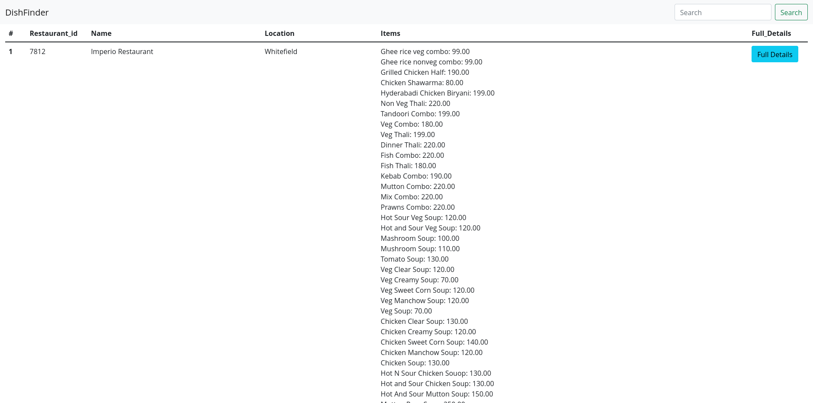
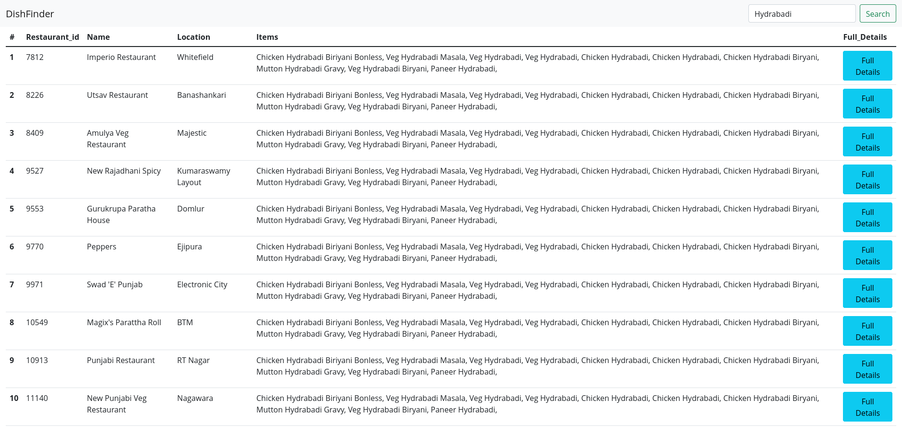

# DishFinder
this is a simple django app for finding dishes from database

# photos

## Some things before running the app:
- I have cleaned the csv file before entering them to avoid breakrage page
- To reload page click on the navbar brand name dishfinder
- Only search one word at a time cause multiword search in json field is not supported by sqlite3.
- This is a basic app.